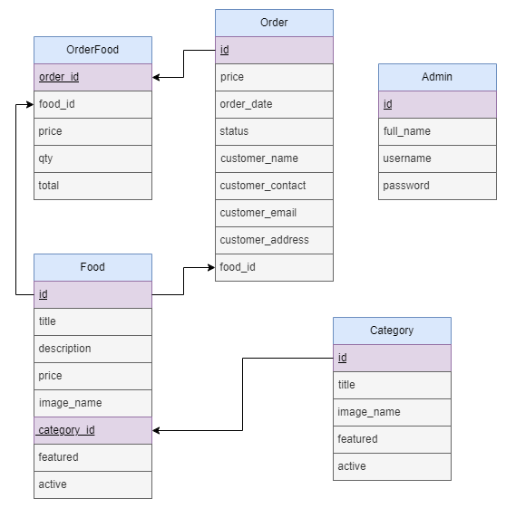
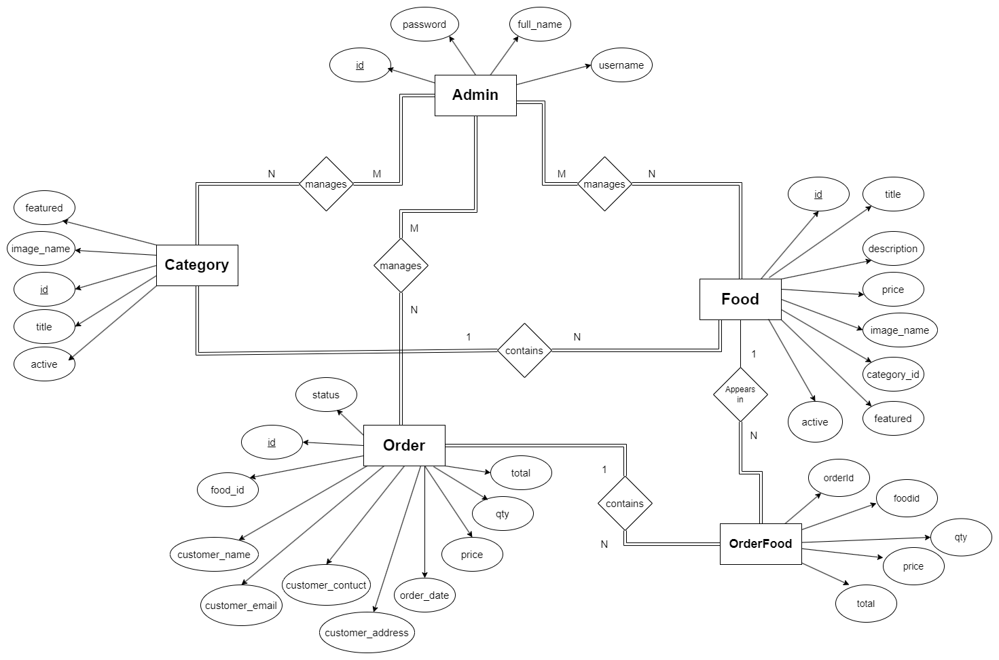

# 🥘 Food Order Website

## 📊 Database Schema and ER Diagram

- **Schema Diagram:**
  

- **ER Diagram:**
  

## 📖 Project Overview

Explore a delicious world of cuisine with our Food Ordering Website. This project allows users to browse categories, select their favorite dishes, and place orders effortlessly. Admins have full control over managing categories, food items, and tracking orders. The website is built using HTML, CSS, PHP, and MySQL.

## ⚙️ Technology Used

1. HTML
2. CSS
3. Core/Procedural PHP programming language
4. MySQL Relational Database

## 🧰 Features

1. **Visitors/Users:**
   - Browse all categories and food items.
   - Place orders easily through the website.
2. **Admin:**
   - Manage admins, categories, and food items.
   - Manage and track food orders and delivery.

## 📽️ Demo Video

Watch the demo video to see the Food Ordering Website in action: [YouTube Demo Video](https://www.youtube.com/watch?v=OgDw4qDq190)

## 📖 How to Download the Project and Run on Your PC?

### Pre-Requisites:

1. Download and Install XAMPP
   - [Click Here to Download](https://www.apachefriends.org/index.html)
2. Install any Text Editor (Sublime Text, Visual Studio Code, Atom, Brackets, etc.)

### Installation

1. **Download the Project:**
   - Download as a Zip file or clone this project repository.

2. **Move to Root Directory:**
   - Move the project folder to the XAMPP root directory:
     ```
     Local Disk C: -> xampp -> htdocs -> 'this project'
     ```
     *(Local Disk C is the location where XAMPP was installed)*

3. **Start Apache and MySQL:**
   - Open XAMPP Control Panel and start 'Apache' and 'MySQL'.

4. **Import the Database:**
   - Open 'phpmyadmin' in your browser.
   - Create a new database.
   - Import the provided SQL file into this database.

5. **Configure Settings:**
   - Go to the 'config' folder and open the 'constants.php' file. Make the following changes:
     ```php
     <?php 
     // Start Session
     session_start();

     // Create Constants to Store Non-Repeating Values
     define('SITEURL', 'http://localhost/food-order/'); // Update the home URL of the project if you have changed the port number or it's live on a server
     define('LOCALHOST', 'localhost');
     define('DB_USERNAME', 'root');
     define('DB_PASSWORD', '');
     define('DB_NAME', 'food-order');
         
     $conn = mysqli_connect(LOCALHOST, DB_USERNAME, DB_PASSWORD) or die(mysqli_error()); // Database Connection
     $db_select = mysqli_select_db($conn, DB_NAME) or die(mysqli_error()); // Selecting Database 
     ?>
     ```

6. **Run the Project:**
   - Open the project in your browser. It should run perfectly at:
     ```
     http://localhost/food-order/
     ```

Feel free to reach out if you have any questions or need further assistance. Enjoy exploring the world of food ordering!

---

Connect with me on LinkedIn: [Mariam Maria](https://www.linkedin.com/in/findmariammariaa/)

---
